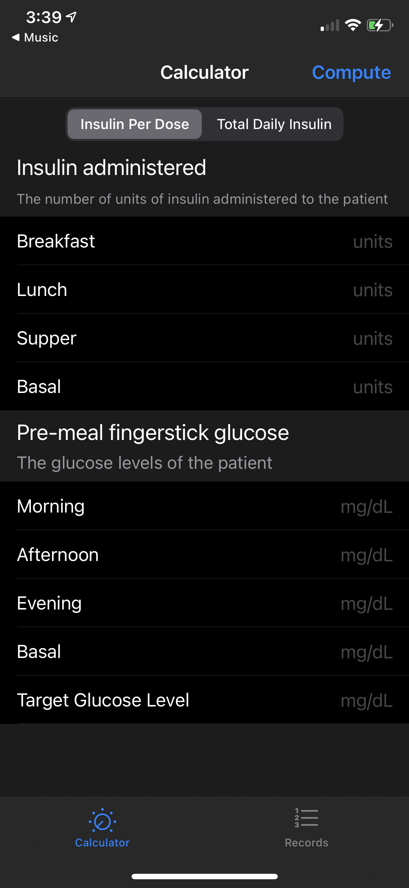

# ISF-Calc
Demo application to calculate insulin sensitivity factor

## Motivation

I was having a conversation with a doctor about technology in the medical industry. He told me how they had tools that helped them with tasks like documentation, ordering meds, etc but what was still lacking were tools that do some of the small tasks they do on a daily basis. One of those tasks was calculating the Insulin Sensitivity Factor for a diabetic patient. This is something that they would calculate for patients before administering insulin or giving them meals. This calculation is something that they do manually and it involves a lot of variables. I decided to design and build a demo application based on the requirements that he gave me. Unfortunately, this was around the time when COVID was ramping up so we ended up putting the project on the back burner.

## Screenshots

  
  
  
  

## Architecture

Project was built using the MVC architecture.

## Tech and Frameworks

Project was built using Swift. All user interface design was done programmatically using UIKit.
